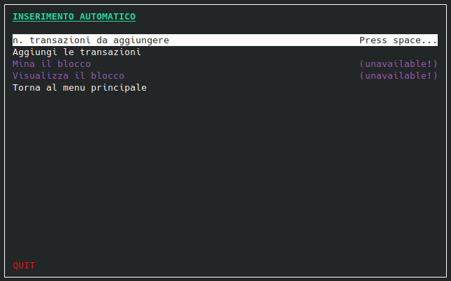

Blockchain Demo
============


Semplice simulatore di una blockchain per la gestione della criptovaluta Bitcoin.


---
## Introduzione


Lo scopo del progetto è poter simulare le dinamiche che sorgono durante la gestione delle transazioni di monete elettroniche, in un sistema decentralizzato e condiviso come una blockchain.


---
## Features

Alcune feature rese disponibili dalla nostra applicazione:

- Inserimento manuale delle transazioni
- Inserimento automatico delle transazioni
- Mining basato su SHA-256
- Visualizzazione del blocco di transazioni
- Salvataggio su file della blockchain


---
## Setup & Installazione

Per compilare il programma, dopo aver clonato questa repo, installa la libreria grafica `ncurses`.

Se usi una distribuzione basata su Ubuntu / Debian:

```bash
sudo apt-get install libncurses-dev
```

Abbiamo previsto anche la generazione **facoltativa** della documentazione con il programma `doxygen`.

Su una distribuzione basata su Ubuntu / Debian, lo puoi installare così:

```bash
sudo apt install doxygen
```


## Compilazione

È possibile compilare il programma principale, oppure la parte di testing dell'applicazione.
Per scegliere l'opzione desiderata modifica il file `CMakeLists.txt` presente nel percorso principale.


### Programma principale

Per compilare il programma principale, imposta il file cmake come di seguito:

```cmake
set(TARGET_GROUP production CACHE STRING "Group to build")
```

Successivamente, crea una cartella `build` dal percorso principale, e da tale cartella esegui il comando `cmake`:

```bash
cmake .. && make && ./app/application
```

*Nota: assicurati di eseguire l'applicazione dalla cartella build.*


### Testing

Per compilare la parte di testing, imposta il file cmake come di seguito:

```cmake
set(TARGET_GROUP test CACHE STRING "Group to build")
```

Successivamente, crea una cartella `build` dal percorso principale, e da tale cartella esegui il comando `cmake`:

```bash
cmake .. && make
```

Le cartelle contenenti i file eseguibili di test dei moduli, sono nel percorso 
`./build/test`.

*Nota: assicurati di eseguire i test dalla cartella build.*


---
## Contribuenti ✨

Si ringraziano queste fantastiche persone per la deterinazione nel portare a termine questo progetto:

<table>
  <tr>
    <td align="center"><a href="https://github.com/Binotto-Andrea"><br /><sub><b>Andrea Binotto
    <td align="center"><a href="https://github.com/filippo-toffano-unipd"><br /><sub><b>Filippo Toffano
    <td align="center"><a href="https://github.com/alberto-trabacchin-unipd"><br /><sub><b>Alberto Trabacchin
    <td align="center"><a href="https://github.com/emanuelezanoni"><br /><sub><b>Emanuele Zanoni
    
  </tr>
</table>
